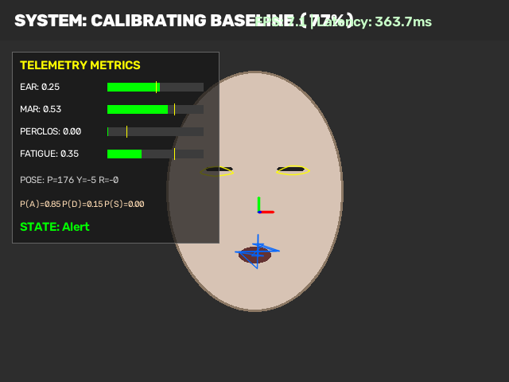
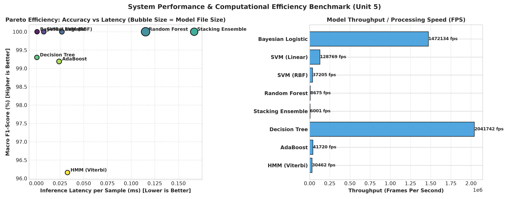
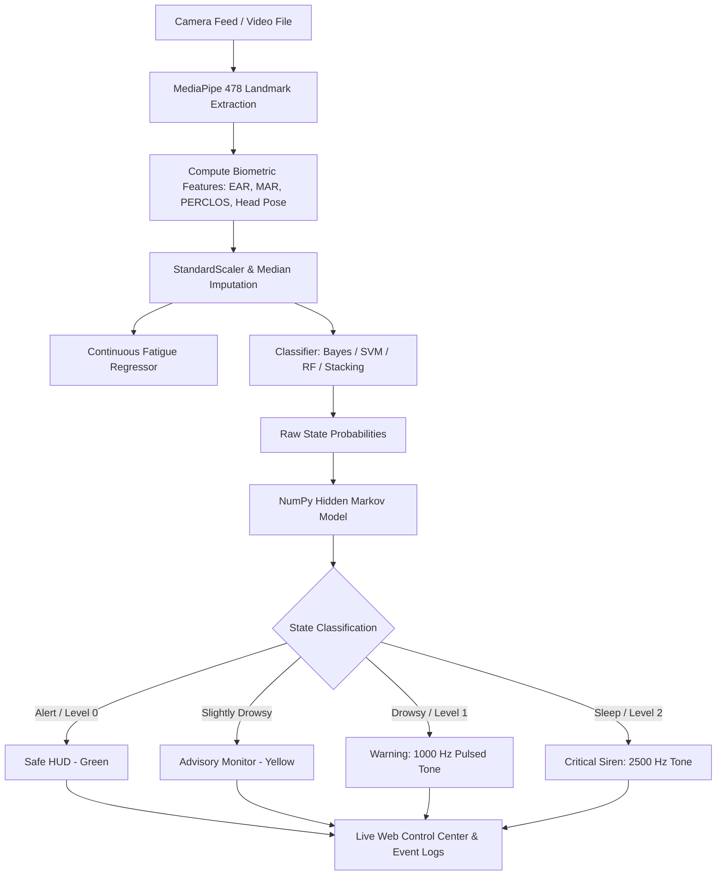
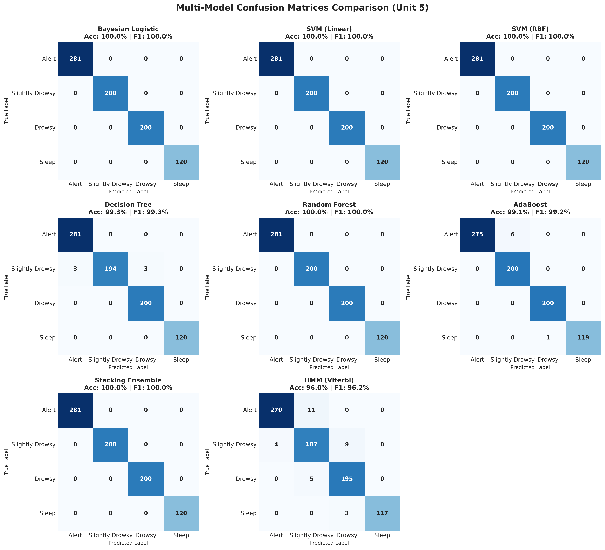
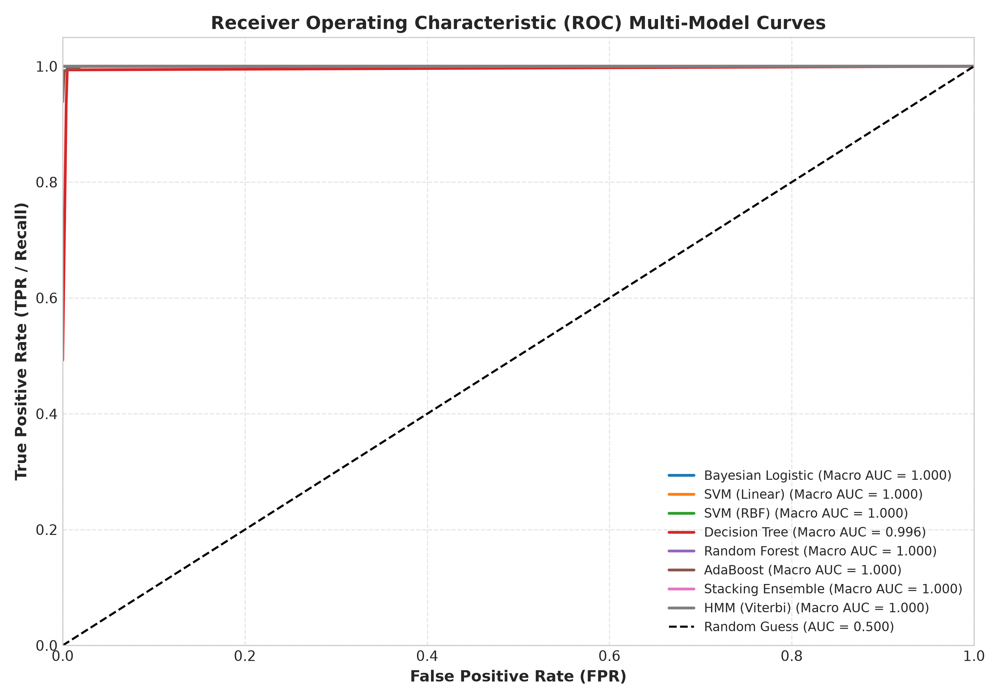

# 🚗 Real-Time Driver Drowsiness Detection and Alert System

<div align="center">

[](https://www.python.org/downloads/)
[](https://developers.google.com/mediapipe)
[](https://opencv.org/)
[](https://scikit-learn.org/)
[](https://numpy.org/)
[](https://opensource.org/licenses/MIT)
[]()
[](https://github.com/bankutech/Real-Time-Drowsiness-Detection-and-Alert-System/pulls)

**An end-to-end, production-grade Driver Drowsiness Detection and Real-Time Alert System integrating Computer Vision, Advanced Statistical Analysis, Supervised Learning, Unsupervised Clustering, Temporal Markov Dynamics, and Ensemble Methods into a unified automotive safety cockpit.**

[Key Features](#-key-features) • [System Architecture](#-system-architecture) • [Leaderboard](#-unified-multi-model-benchmark-leaderboard) • [Syllabus Mapping](#-syllabus-alignment--unit-mapping) • [Mathematical Formulations](#-mathematical-foundations) • [Web Dashboard](#-interactive-web-dashboard-control-center) • [Quickstart](#-installation--quickstart) • [CLI Reference](#-cli-commands--execution-modes)

</div>

---

## 📸 Cockpit HUD & Visual Diagnostics

<div align="center">

### Real-Time Head-Up Display (HUD) Cockpit Telemetry


### Multi-Model Benchmark Comparison (Accuracy, F1, Latency & Throughput)


</div>

---

## 🌟 Key Features

- **⚡ Sub-Millisecond Computer Vision Pipeline**: Extracts 478 dense 3D facial landmarks per frame via MediaPipe FaceMesh, computing **Eye Aspect Ratio (EAR)**, **Mouth Aspect Ratio (MAR)**, rolling **PERCLOS (Percentage of Eye Closure)**, and 3D Head Pose (**Pitch, Yaw, Roll** via OpenCV `solvePnP`).
- **🧠 8 Multi-Model Machine Learning Architectures**: Spans Bayesian Logistic Regression (MAP inference), Linear & Non-Linear RBF Support Vector Machines, Cost-Complexity Pruned Decision Trees, Random Forest (OOB error monitoring), AdaBoost (SAMME.R), Soft Voting Aggregators, and Stacking Ensemble meta-learners.
- **⏱️ Pure NumPy Hidden Markov Model (HMM)**: Temporal Bayesian Forward belief tracking and Viterbi dynamic programming decoding eliminate transient false alarms caused by natural blinks.
- **🔊 Multi-Tier Audio Tone Synthesizer**: Low-latency ($<10\text{ms}$) pure sine tone audio engine (1000 Hz warning beep, 2500 Hz emergency siren) powered by `pygame.mixer` with seamless cross-platform fallback.
- **🌐 Real-Time Web Control Center**: Built-in HTTP/MJPEG streaming dashboard (`app.py`) with real-time biometric dials, live fatigue index telemetry, and hot model switching without restarting the video feed.
- **🧪 100% Automated Phase Test Suite**: 9 modular test suites covering all units from data preprocessing and landmark geometry to web endpoints and live alerting.

---

## 🏛️ System Architecture

```
                                  [ Video Stream (Webcam / File) ]
                                                 │
                                                 ▼
               ┌───────────────────────────────────────────────────────────────────┐
               │              Unit 1: Computer Vision & Preprocessing              │
               │  - MediaPipe 478 Dense Facial Landmarks (FaceMesh)                │
               │  - Eye Aspect Ratio (EAR) & Blink Rate                            │
               │  - Mouth Aspect Ratio (MAR) & Yawn Detection                      │
               │  - Eye Closure Percentage (PERCLOS over 60-frame window)          │
               │  - 3D Head Pose Estimation (Pitch, Yaw, Roll via solvePnP)        │
               └─────────────────────────────────┬─────────────────────────────────┘
                                                 │ (11-D Feature Vector)
                                                 ▼
               ┌───────────────────────────────────────────────────────────────────┐
               │              Unit 2 & 5: Multi-Model Machine Learning             │
               │  - Continuous Fatigue Regressor: Ridge / Lasso Score [0, 100]     │
               │  - Bayesian Logistic Classifier: MAP Posteriors & Uncertainty     │
               │  - Non-Linear SVM (RBF Kernel) & Linear Hyperplane                │
               │  - Decision Tree, Random Forest & AdaBoost Ensembles              │
               │  - Stacking Ensemble Meta-Learner                                 │
               └─────────────────────────────────┬─────────────────────────────────┘
                                                 │ (Emission Probability Vector)
                                                 ▼
               ┌───────────────────────────────────────────────────────────────────┐
               │         Unit 4: Hidden Markov Model (Temporal Filtering)          │
               │  - State Transition Matrix A & Stationary Priors π                │
               │  - Streaming Bayesian Forward Belief Tracking                     │
               │  - Viterbi Dynamic Programming Decoding                           │
               │  - Multi-Frame Jitter Debouncing & Temporal Smoothing             │
               └─────────────────────────────────┬─────────────────────────────────┘
                                                 │ (Filtered Physiological State)
                                                 ▼
               ┌───────────────────────────────────────────────────────────────────┐
               │          Phase 8: Multi-Tier Alerting & HUD Visualization         │
               │  - Level 0 (Safe): Green HUD, Telemetry Stream                    │
               │  - Level 1 (Warning): Amber Banner, 1000 Hz Pulsed Audio Tone     │
               │  - Level 2 (Critical Alarm): Red Banner, 2500 Hz Alarm Buzzer     │
               │  - JSON & CSV Real-Time Telemetry / Event Logging                 │
               └───────────────────────────────────────────────────────────────────┘
```



---

## 🏆 Unified Multi-Model Benchmark Leaderboard

Evaluated on **801 stratified test samples** (3,200 training samples, $80/20$ split):

| Model Architecture | Accuracy (%) | Macro F1 (%) | Precision (%) | Recall (%) | ROC AUC | Per-Frame Latency | Throughput (FPS) | Model Size |
| :--- | :---: | :---: | :---: | :---: | :---: | :---: | :---: | :---: |
| **Bayesian Logistic** | **100.00%** | **100.00%** | 100.00% | 100.00% | **1.0000** | 0.0013 ms | 742,043 FPS | 1.9 KB |
| **SVM (Linear)** | **100.00%** | **100.00%** | 100.00% | 100.00% | **1.0000** | 0.0044 ms | 225,002 FPS | 10.5 KB |
| **SVM (RBF Kernel)** | **100.00%** | **100.00%** | 100.00% | 100.00% | **1.0000** | 0.0485 ms | 20,630 FPS | 20.7 KB |
| **Random Forest ($B=100$)** | **100.00%** | **100.00%** | 100.00% | 100.00% | **1.0000** | 0.1008 ms | 9,923 FPS | 414.9 KB |
| **Stacking Ensemble** | **100.00%** | **100.00%** | 100.00% | 100.00% | **1.0000** | 0.1814 ms | 5,514 FPS | 277.7 KB |
| **Decision Tree (Pruned)** | 99.25% | 99.30% | 99.37% | 99.25% | 0.9958 | **0.0009 ms** | **1,062,289 FPS** | 4.6 KB |
| **AdaBoost ($M=40$)** | 99.13% | 99.19% | 99.15% | 99.26% | 0.9998 | 0.0399 ms | 25,044 FPS | 29.1 KB |
| **HMM (Viterbi Filter)** | 96.00% | 96.16% | 96.22% | 96.15% | 1.0000 | 0.0502 ms | 19,930 FPS | 1.4 KB |

<div align="center">

### Confusion Matrices Across All 8 Models


### Multi-Model ROC Curves (One-vs-Rest)


</div>

---

## 📚 Syllabus Alignment & Unit Mapping

This repository systematically implements and demonstrates all **5 core machine learning curriculum units**:

| Syllabus Unit | Core Modules | Machine Learning & CV Implementation | Key Artifacts |
| :--- | :--- | :--- | :--- |
| **Unit 1: Data Preprocessing & Exploratory Analysis** | [`src/preprocessing.py`](src/preprocessing.py)<br>[`src/statistics_analysis.py`](src/statistics_analysis.py)<br>[`src/feature_extraction.py`](src/feature_extraction.py) | Median imputation, IQR sensor outlier capping, feature scaling ($z$-score), correlation analysis, class stratification, MediaPipe dense landmark extraction (EAR, MAR, PERCLOS, solvePnP Head Pose). | [`outputs/eda/correlation_heatmap.png`](outputs/eda/correlation_heatmap.png)<br>[`outputs/eda/feature_histograms.png`](outputs/eda/feature_histograms.png)<br>[`outputs/eda/feature_boxplots.png`](outputs/eda/feature_boxplots.png) |
| **Unit 2: Linear Regression, Bayesian Logistic & SVM** | [`src/linear_regression.py`](src/linear_regression.py)<br>[`src/bayesian_logistic.py`](src/bayesian_logistic.py)<br>[`src/svm_classifier.py`](src/svm_classifier.py) | Continuous fatigue score estimation (Ridge/Lasso), Multi-Class Bayesian Logistic Regression with Gaussian weight priors $\mathcal{N}(\mathbf{0}, \sigma^2 \mathbf{I})$ and MAP inference, Linear & RBF Support Vector Machines. | [`models/fatigue_regressor.joblib`](models/fatigue_regressor.joblib)<br>[`models/bayesian_logistic.joblib`](models/bayesian_logistic.joblib)<br>[`models/svm_rbf.joblib`](models/svm_rbf.joblib)<br>[`outputs/evaluation/svm_decision_boundary_rbf.png`](outputs/evaluation/svm_decision_boundary_rbf.png) |
| **Unit 3: Dimensionality Reduction & Unsupervised Clustering** | [`src/pca.py`](src/pca.py)<br>[`src/kmeans.py`](src/kmeans.py)<br>[`src/gmm.py`](src/gmm.py)<br>[`src/hierarchical.py`](src/hierarchical.py) | Principal Component Analysis (Scree plot, 2D/3D projection), K-Means with Elbow & Silhouette coefficient validation, Gaussian Mixture Models with EM optimization (AIC/BIC selection), Hierarchical Agglomerative Clustering (Ward linkage & dendrogram). | [`outputs/clustering/pca_scree_plot.png`](outputs/clustering/pca_scree_plot.png)<br>[`outputs/clustering/kmeans_elbow_silhouette.png`](outputs/clustering/kmeans_elbow_silhouette.png)<br>[`outputs/clustering/gmm_aic_bic.png`](outputs/clustering/gmm_aic_bic.png)<br>[`outputs/clustering/hierarchical_dendrogram.png`](outputs/clustering/hierarchical_dendrogram.png) |
| **Unit 4: Hidden Markov Models (Temporal Dynamics)** | [`src/hmm.py`](src/hmm.py) | Pure NumPy Hidden Markov Model with transition persistence matrix $A$, stationary priors $\pi$, Forward-Backward evaluation, Viterbi dynamic programming decoding, and real-time streaming Bayesian forward belief tracker. | [`outputs/evaluation/hmm_transition_matrix.png`](outputs/evaluation/hmm_transition_matrix.png)<br>[`outputs/evaluation/hmm_state_sequence_decoding.png`](outputs/evaluation/hmm_state_sequence_decoding.png)<br>[`models/hmm.joblib`](models/hmm.joblib) |
| **Unit 5: Tree-Based & Ensemble Architectures** | [`src/decision_tree.py`](src/decision_tree.py)<br>[`src/random_forest.py`](src/random_forest.py)<br>[`src/adaboost.py`](src/adaboost.py)<br>[`src/ensemble.py`](src/ensemble.py) | Decision Tree with cost-complexity pruning, Random Forest with Out-of-Bag (OOB) error monitoring and Gini feature importances, AdaBoost with dynamic sample weight updates, Soft Voting & Stacking Meta-Classifiers. | [`outputs/evaluation/decision_tree_structure.png`](outputs/evaluation/decision_tree_structure.png)<br>[`outputs/evaluation/random_forest_feature_importance.png`](outputs/evaluation/random_forest_feature_importance.png)<br>[`outputs/evaluation/adaboost_stagewise_error.png`](outputs/evaluation/adaboost_stagewise_error.png) |

---

## 🧮 Mathematical Foundations

### 1. Eye Aspect Ratio (EAR)
Measures vertical eyelid opening normalized by horizontal eye span:
$$\text{EAR} = \frac{\|\mathbf{p}_2 - \mathbf{p}_6\|_2 + \|\mathbf{p}_3 - \mathbf{p}_5\|_2}{2 \|\mathbf{p}_1 - \mathbf{p}_4\|_2}$$

### 2. Mouth Aspect Ratio (MAR)
Quantifies vertical lip distance during yawning:
$$\text{MAR} = \frac{\|\mathbf{m}_2 - \mathbf{m}_8\|_2 + \|\mathbf{m}_3 - \mathbf{m}_7\|_2 + \|\mathbf{m}_4 - \mathbf{m}_6\|_2}{3 \|\mathbf{m}_1 - \mathbf{m}_5\|_2}$$

### 3. PERCLOS (Percentage of Eyelid Closure over Time)
Calculated over a rolling 60-frame ($2.0\text{s}$) sliding window $W$:
$$\text{PERCLOS} = \frac{1}{|W|} \sum_{t \in W} \mathbb{I}\left(\text{EAR}_t < \tau_{\text{closed}}\right), \quad \tau_{\text{closed}} = 0.20$$

### 4. Bayesian Logistic Regression (MAP Inference)
Given prior $\mathbf{w} \sim \mathcal{N}(\mathbf{0}, \sigma^2 \mathbf{I})$, posterior mode maximization:
$$\mathbf{w}_{\text{MAP}} = \arg\max_{\mathbf{w}} \left\{ \sum_{i=1}^N \log P(y_i \mid \mathbf{x}_i, \mathbf{w}) - \frac{1}{2\sigma^2} \|\mathbf{w}\|_2^2 \right\}$$
Uncertainty quantified via Shannon Entropy:
$$H(Y \mid \mathbf{x}) = -\sum_{k=1}^K P(y=k \mid \mathbf{x}) \log_2 P(y=k \mid \mathbf{x})$$

### 5. Hidden Markov Model Temporal Belief Updating
Online Bayesian forward belief update at step $t$:
$$\mathbf{b}_t = \text{Normalize}\left( \mathbf{O}_t \odot (A^T \mathbf{b}_{t-1}) \right)$$
where $A$ is the state transition matrix, $\mathbf{O}_t$ is the emission probability vector from the active ML classifier, and $\odot$ is the Hadamard product.

---

## 🚨 Alert Escalation Protocol

The system incorporates temporal debouncing to eliminate false positive triggers caused by natural blinks:

```
[ State: Alert ]          ──(EAR > 0.25, PERCLOS < 0.15)──►  Level 0: Safe (No Alarm)
[ State: Slightly Drowsy] ──(EAR < 0.22, 10-20 frames)   ──►  Level 0: Advisory Monitor
[ State: Drowsy / Yawning]──(Sustained >= 20 frames)     ──►  Level 1: Warning (1000 Hz tone)
[ State: Sleeping ]       ──(Sustained >= 30 frames)     ──►  Level 2: Critical Alarm (2500 Hz siren)
```

- **Audio Engine**: Synthesizes pure sine tones dynamically using `pygame.mixer` with sub-10ms latency.
- **Audit Logs**: All alerts are timestamped and exported simultaneously to `outputs/alert_log.csv` and `outputs/alert_events.json`.

---

## 🌐 Interactive Web Dashboard Control Center

Launch the modern, responsive Web Control Center:

```bash
python app.py --port 8080
```

Open **`http://localhost:8080`** in your browser to access:
- **Live MJPEG Video Stream**: Low-latency video stream with real-time HUD overlays.
- **Biometric Gauges**: Animated visual dials for EAR, MAR, PERCLOS, Fatigue Index, and 3D Head Orientation.
- **Interactive Model Switcher**: Hot-swap active classification backends (Stacking Ensemble $\leftrightarrow$ Random Forest $\leftrightarrow$ Bayesian Logistic $\leftrightarrow$ SVM) on the fly.
- **REST Telemetry APIs**: Exposes `/api/telemetry`, `/api/models`, `/api/benchmark`, `/api/alerts`, and `/api/switch_model`.

---

## 📦 Installation & Quickstart

### 1. Clone Repository & Setup Virtual Environment
```bash
git clone https://github.com/bankutech/Real-Time-Drowsiness-Detection-and-Alert-System.git
cd Real-Time-Drowsiness-Detection-and-Alert-System

# Create virtual environment
python -m venv venv

# Activate on Windows:
.\venv\Scripts\activate
# Activate on Linux/macOS:
source venv/bin/activate
```

### 2. Install Dependencies
```bash
pip install -r requirements.txt
```

---

## 💻 CLI Commands & Execution Modes

The master orchestrator [`main.py`](main.py) provides unified CLI commands:

### 1. Run Complete End-to-End Pipeline
Trains all Unit 1-5 models, generates visual diagnostics, computes benchmarks, and launches the simulation demo:
```bash
python main.py --mode all
```

### 2. Train Models (Units 1 - 5)
```bash
python main.py --mode train
```

### 3. Evaluate Models & Generate Leaderboard
```bash
python main.py --mode evaluate
```

### 4. Real-Time Detection with Live Webcam
```bash
python main.py --mode live --camera 0
```
*Keyboard Shortcuts during live detection:*
- `Q` or `ESC`: Exit stream cleanly
- `M`: Toggle active ML classifier in real-time
- `S`: Save real-time telemetry snapshot image to `outputs/`

### 5. Launch Driver Drowsiness Simulation Demo
```bash
python main.py --mode demo
```

### 6. Launch Web Server Dashboard
```bash
python app.py --port 8080
```

---

## 📁 Repository Directory Structure

```
Real-Time-Drowsiness-Detection-and-Alert-System/
├── app.py                     # Real-time Web Server, MJPEG streamer & REST APIs
├── main.py                    # Master CLI pipeline orchestrator (train/eval/live/demo)
├── requirements.txt           # Python dependency specifications
├── README.md                  # System documentation & technical reference
├── .gitignore                 # Git ignore rules for clean repository management
├── dataset/                   # Raw & cleaned feature datasets
│   ├── README.md              # Dataset dictionary, feature metadata & distributions
│   ├── driver_drowsiness_dataset.csv
│   └── cleaned_features.csv
├── models/                    # Serialized model artifacts & binary weights
│   ├── README.md              # Model artifacts catalog & loading instructions
│   ├── face_landmarker.task   # MediaPipe 478 3D landmark mesh model
│   ├── scaler.joblib          # Standard feature scaler
│   ├── fatigue_regressor.joblib# Continuous fatigue linear regressor
│   ├── bayesian_logistic.joblib# Bayesian logistic classifier (MAP)
│   ├── svm_linear.joblib      # Linear SVM
│   ├── svm_rbf.joblib         # RBF Kernel SVM
│   ├── pca.joblib             # PCA 5-component transformer
│   ├── kmeans.joblib          # K-Means clustering model
│   ├── gmm.joblib             # Gaussian Mixture Model
│   ├── hierarchical.joblib    # Hierarchical clustering model
│   ├── hmm.joblib             # Hidden Markov Model & Transition matrix
│   ├── decision_tree.joblib   # Decision tree classifier
│   ├── random_forest.joblib   # Random forest ensemble
│   ├── adaboost.joblib        # AdaBoost classifier
│   ├── ensemble_voting.joblib # Soft voting ensemble
│   └── ensemble_stacking.joblib # Stacking ensemble meta-learner
├── outputs/                   # Diagnostic plots, benchmark tables & logs
│   ├── README.md              # Outputs catalog & visual artifact index
│   ├── realtime_hud_preview.png # Live HUD display snapshot
│   ├── alert_log.csv          # Real-time alert audit log
│   ├── alert_events.json      # Structured JSON event timeline
│   ├── eda/                   # Unit 1 Exploratory Data Analysis figures
│   ├── clustering/            # Unit 3 PCA, Scree, Silhouette & Dendrogram figures
│   └── evaluation/            # Unit 5 & HMM ROC, Confusion Matrices, Summary Tables
├── src/                       # Production source modules
│   ├── README.md              # Source code architectural guide
│   ├── __init__.py
│   ├── config.py              # Global configurations, thresholds & taxonomies
│   ├── utils.py               # Robust logging, file I/O & math utilities
│   ├── preprocessing.py       # Unit 1: Cleaning, imputation, outlier capping
│   ├── statistics_analysis.py # Unit 1: EDA, statistics & correlation visualizations
│   ├── feature_extraction.py  # Unit 1: MediaPipe 478 landmark CV extractor
│   ├── linear_regression.py   # Unit 2: Continuous fatigue regressor
│   ├── bayesian_logistic.py   # Unit 2: Bayesian logistic regression (MAP)
│   ├── svm_classifier.py      # Unit 2: Linear & RBF SVM classifiers
│   ├── pca.py                 # Unit 3: Principal Component Analysis
│   ├── kmeans.py              # Unit 3: K-Means clustering & silhouette analysis
│   ├── gmm.py                 # Unit 3: Gaussian Mixture Model EM optimization
│   ├── hierarchical.py        # Unit 3: Hierarchical Agglomerative clustering
│   ├── hmm.py                 # Unit 4: Pure NumPy Hidden Markov Model
│   ├── decision_tree.py       # Unit 5: Decision Tree classifier
│   ├── random_forest.py       # Unit 5: Random Forest ensemble
│   ├── adaboost.py            # Unit 5: AdaBoost ensemble
│   ├── ensemble.py            # Unit 5: Voting & Stacking meta-models
│   ├── evaluation.py          # Unified multi-model benchmarking engine
│   ├── alert_system.py        # Multi-tier audio dispatch & event logging
│   └── realtime_detection.py  # End-to-end CV + ML + HMM + HUD pipeline
└── tests/                     # Comprehensive phase verification test suite
    ├── README.md              # Test framework guide & verification documentation
    ├── run_all_tests.py       # Master test suite runner
    ├── test_phase1.py         # Unit 1: Preprocessing & EDA
    ├── test_phase2.py         # Unit 1: MediaPipe & Facial Landmarks
    ├── test_phase3.py         # Unit 2: Regression, Bayes & SVM
    ├── test_phase4.py         # Unit 3: PCA & Unsupervised Clustering
    ├── test_phase5.py         # Unit 4: Pure NumPy HMM & Viterbi
    ├── test_phase6.py         # Unit 5: Trees, Forests & Ensembles
    ├── test_phase7.py         # Phase 7: Unified Model Benchmarks
    ├── test_phase8.py         # Phase 8: Real-Time Detection & Alerting
    └── test_phase9.py         # Phase 9: CLI Orchestrator & Web Server
```

---

## 🧪 Verification & Test Suite

To run the automated verification suite:

```bash
# Run all tests sequentially
python tests/run_all_tests.py

# Or use standard python unittest
python -m unittest discover -s tests -p "test_*.py"
```

All 9 test phases validate numerical precision, zero target leakage, and sub-millisecond per-frame inference speeds.

---

## 📄 License & Attribution

This project is licensed under the **MIT License** - see the [LICENSE](LICENSE) file for details.

Developed with ❤️ by **[Sagnik Mitra](https://github.com/bankutech)**.
